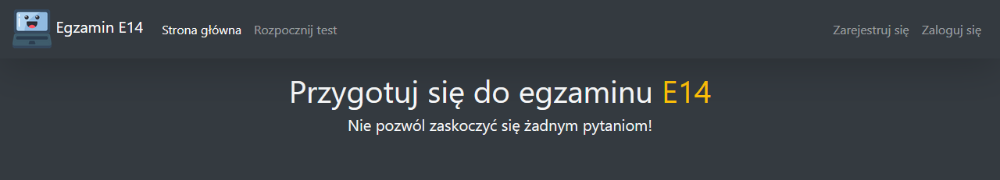
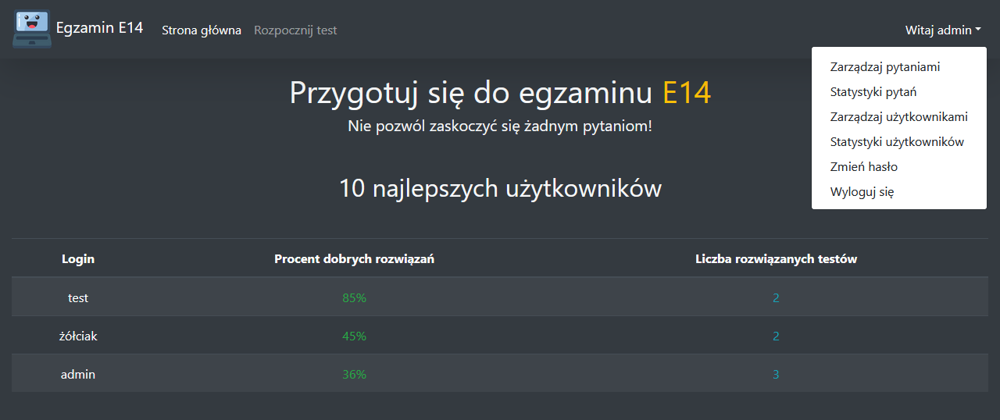
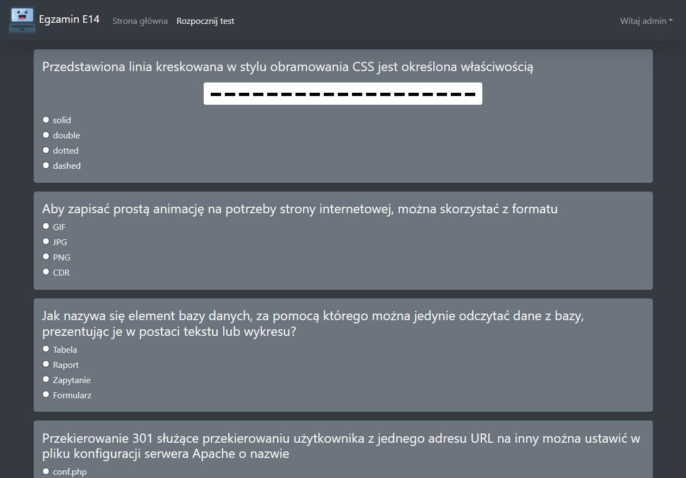
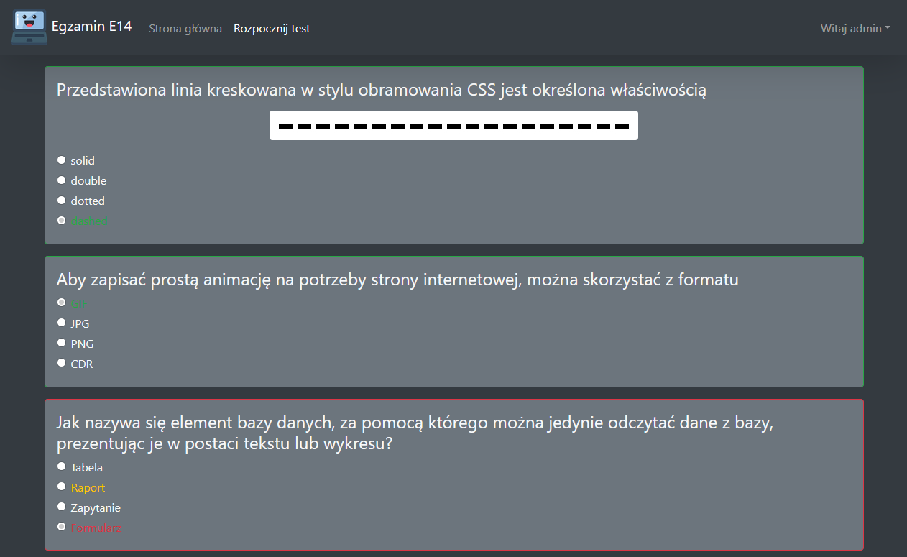
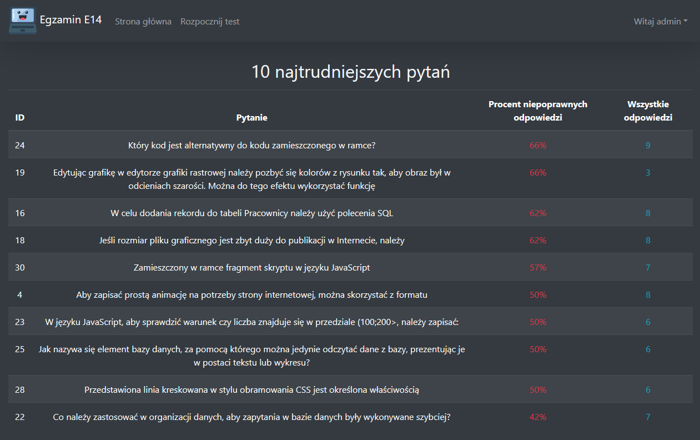
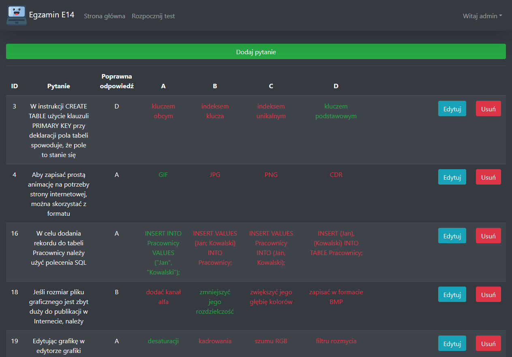
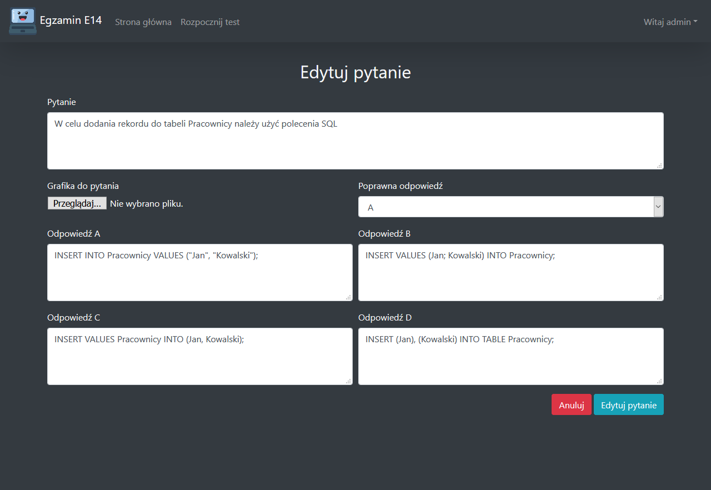

# Strona do rozwiązywania testów + panel administracyjny
Projekt strony internetowej umożliwiający rozwiązywanie testów. Obsługuje rejestrację nowych użytkowników, statystyki odpowiedzi oraz zapewnia uprawnionemu użytkownikowi panel administracyjny z funkcjami pozwalającymi zarządzać serwisem. Backend obsłużony za pomocą jezyka PHP.
## Funkcje
- Rejestracja i logowanie (hasło musi posiadać co najmniej 6 znaków)
- Rozwiązywanie testów
  - 10 losowych pytań z bazy danych
  - Wynik testu
  - Zaznaczanie poprawnych i błędnych odpowiedzi
- Statystyki pytań
- Panel administracyjny
  - Zarządzanie pytaniami
    - Możliwość dodania, edytowania i usunięcia pytania
    - Wybór poprawnej odpowiedzi
    - Możliwośc dodania i usunięcia grafiki do pytania
  - Zarządzanie użytkownikami
    - Przyznawanie i odbieranie uprawnień administracyjnych
    - Usuwanie użytkowników
  - Szczegółowe statystyki pytań i użytkowników
## Wygląd strony

Dane logowania do konta administracyjnego w przykładowej bazie danych - login: admin, hasło: admin

~ 12.2019
